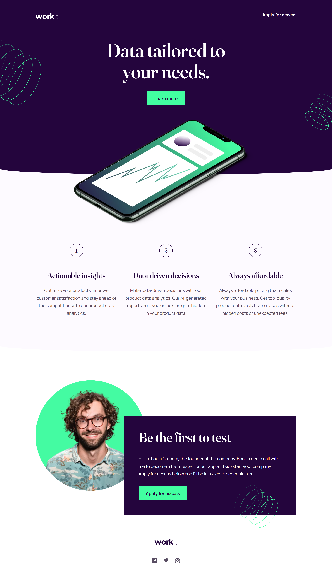

# Frontend Mentor - Workit landing page solution

This is a solution to the [Workit landing page challenge on Frontend Mentor](https://www.frontendmentor.io/challenges/workit-landing-page-2fYnyle5lu). Frontend Mentor challenges help you improve your coding skills by building realistic projects. 

## Table of contents

- [Overview](#overview)
  - [The challenge](#the-challenge)
  - [Screenshot](#screenshot)
  - [Links](#links)
- [My process](#my-process)
  - [Built with](#built-with)
  - [What I learned](#what-i-learned)
- [Author](#author)

## Overview
- A fully-responsive landing page built with HTML and CSS

### The challenge
- Create a fully-responsive landing page, using the provided *Figma* file as your style guide and reference

### Screenshot

### Links
- Live Site URL: https://bucolic-daifuku-0e2b9e.netlify.app

## My process
- Utilized various *flexbox* properties to achieve the desired responsiveness and to match the provided design spec
- Used a *container* class to set the max-width of the different sections, allowing for full-width backgrounds
- Used a mobile-first approach to writing CSS
- Adjusted *flexbox* properties within media queries to adapt the website to larger device sizes
 

### Built with
- Semantic HTML5 markup
- CSS custom properties
- CSS Flexbox
- Mobile-first approach to CSS

### What I learned
- How to navigate *Figma* at a basic level (this was my first time using and navigating Figma)
- What to look for in a *style guide*, and how to translate that guide into reusable CSS properties and variables
- A basic solution to creating overlapping elements that are also responsive
- Working with *variable fonts*

## Author
Ryan Hemrick